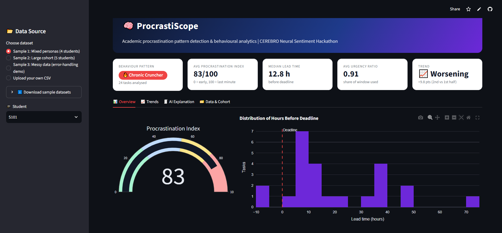

# 🧠 ProcrastiScope: Academic Procrastination Pattern Detector

> **CEREBRO Neural Sentiment Hackathon (IEM Kolkata)**: Problem Statement 1: *Detecting Academic Procrastination Patterns*

ProcrastiScope analyzes a student's academic activity history, measures *how* close to the deadline they work, classifies their behavior, tracks whether they are improving or worsening, and explains the verdict in plain language.

  



**🔗 Live demo:** `<https://procrastiscope.streamlit.app/>`

---

## ✨ Features

| Area | What it does |
|---|---|
| **Data** | Three built-in datasets (mixed personas, large cohort, deliberately messy) plus CSV upload and sample downloads |
| **Metrics** | Lead Time, Submission Urgency Ratio, Procrastination Index (0-100) per task |
| **Classification** | Early Bird, Steady Worker, Last-Minute Procrastinator, Chronic Cruncher |
| **Trends** | First-half vs second-half comparison, regression line, per-semester averages |
| **Visuals** | Gantt timeline, lead-time distribution, gauge, trend line, category/hour charts, cohort comparison |
| **Explainability** | Rule-based narrative explaining *why* a student got their label, with a recommendation |
| **Robustness** | Column normalization, invalid-row removal with warnings, safe fallback; the app never crashes on bad input |

---

## 🚀 Quick start

```bash
git clone https://github.com/pujita-achary/procrastination_analyzer.git
cd procrastination_analyzer
python -m venv .venv && source .venv/bin/activate   # Windows: .venv\Scripts\activate
pip install -r requirements.txt
streamlit run app.py
```

Open http://localhost:8501.

---

## 📐 Methodology

For each task, with `assigned`, `deadline` and `submitted` timestamps:

| Metric | Definition |
|---|---|
| **Lead Time (h)** | `deadline − submitted` (negative means late) |
| **Urgency Ratio** | `(submitted − assigned) / (deadline − assigned)` (0 = immediately, 1 = at the deadline) |
| **Procrastination Index** | `90 × clip(ratio, 0, 1) + 10 if late`, bounded to 0-100 |

### Behavior classes (per student, over all tasks)

| Pattern | Rule |
|---|---|
| 🔥 **Chronic Cruncher** | mean index ≥ 70 **and** ≥ 50% of tasks submitted in the last 10% of the window |
| ⏳ **Last-Minute Procrastinator** | mean index ≥ 55 |
| ⚙️ **Steady Worker** | mean index ≥ 30 |
| 🐦 **Early Bird** | mean index < 30 |

### Trend detection
The mean index of the second half of a student's task history is compared with the first half. A difference of **+5 points or more is *Worsening***, **−5 or less is *Improving***, otherwise *Stable*. A linear regression line is drawn over the task sequence.

> The weights and thresholds are interpretable heuristics, chosen for transparency. They are easy to tune in `compute_metrics()` and `classify()`.

---

## 📄 CSV format

| Column | Required | Notes |
|---|---|---|
| `task_name` | ✅ | |
| `assigned_date` | ✅ | any pandas-parsable datetime |
| `deadline` | ✅ | must be after `assigned_date` |
| `submission_time` | ✅ | |
| `student_id` | optional | defaults to a single student |
| `task_category` | optional | defaults to `General` |
| `word_count` / `effort_score` | optional | used for effort-vs-delay insight |

Column headers are case-insensitive and spaces are accepted. Rows with unparseable or inconsistent dates are dropped with a warning.

---

## 🗂️ Project structure

```
├── app.py            # data generation, analytics engine, UI
├── requirements.txt
├── README.md
└── screenshots/
```

## 🔭 Future scope
- Integrate real LMS data (Moodle, Canvas, Google Classroom)
- Learn thresholds with unsupervised clustering instead of fixed rules
- Early-warning alerts to advisors when a student's trend turns worsening
- Add sentiment and stress signals for a fuller "neural sentiment" view

## 👥 Team
`<nayakprayas323002>` — `<Prayas Kumar Nayak,CH PUJITA ACHARY, Swabhimaan Maharana >` — IEM Kolkata

## 📜 License
MIT
